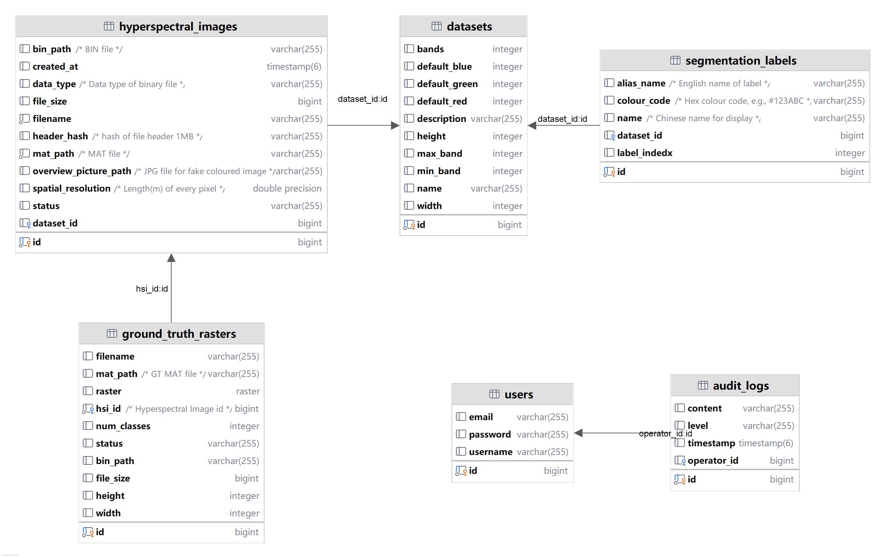

## 界面设计

本系统采用前后端分离架构，前端基于React与TypeScript开发，通过Vite构建工具实现高效的热更新与生产打包。界面设计遵循组件化与分层架构原则，自底向上划分为基础设施层、组件层、页面层与布局层。基础设施层通过React Context API实现主题管理，支持浅色、深色与跟随系统三种模式的动态切换；组件层基于Radix UI无头组件库封装基础交互元素，并针对高光谱分析场景定制开发文件上传、图像查看器、光谱统计图表、PCA点云可视化等业务组件。

系统采用侧边栏导航布局，通过React Router实现客户端路由管理，将高光谱图像管理、图像检视、光谱分析、地面真值管理等功能模块组织为清晰的信息架构。系统主界面如图1所示，展示了侧边栏导航与数据管理页面的整体布局。

图1 系统主界面与数据集管理

核心可视化组件包括：高光谱图像查看器，支持单波段灰度显示与多波段假彩色合成，通过Canvas API实现像素级渲染。图2展示了高光谱图像假彩色显示界面，用户可以查看假彩色合成后的高光谱图像效果。

图2 高光谱图像假彩色显示界面

光谱统计图表基于ECharts实现，支持按地物类别聚合的光谱曲线对比。系统通过ECharts的line系列类型绘制连续光谱曲线，以波段索引为横轴、反射率值为纵轴。当存在地面真值标注时，系统按类别聚合光谱数据，计算每个类别的均值曲线与标准差区间，以多系列叠加的形式呈现类别间的光谱可分性。图表支持数据缩放（DataZoom）、图例筛选、提示框（Tooltip）等交互功能，用户可通过框选放大感兴趣的光谱区间进行细节观察。图3展示了基于ECharts的光谱特征绘制界面，清晰呈现了不同地物类别的光谱反射率曲线对比。

图3 基于ECharts的光谱特征绘制界面

PCA点云可视化基于ECharts GL实现WebGL加速的三维渲染，将高维光谱数据降维后的主成分得分以交互式点云形式呈现。系统通过主成分分析（PCA）算法将高维光谱空间映射到低维特征空间，每个像素对应三维空间中的一个点，坐标为前三个主成分得分$(PC_1, PC_2, PC_3)$。当存在地面真值标注时，点云按类别着色，不同地物类别在特征空间中的分布模式得以清晰呈现。三维场景支持旋转、缩放、平移等相机操作，用户可从多角度观察数据分布。图4展示了PCA三维点云可视化界面，直观呈现了高光谱数据在降维后的空间聚类结构。

图4 基于ECharts GL的PCA三维点云可视化

系统还提供地面真值管理功能，支持上传、查看和分析地表真值标注数据。图5展示了地面真值显示界面，用户可以查看各类别的空间分布与统计信息。

图5 地面真值显示界面

界面采用Tailwind CSS原子化样式方案，结合响应式设计策略，确保在桌面端与移动端均具备良好的可用性。整体设计风格简洁专业，符合遥感分析领域的使用习惯。

## 数据库设计

系统采用 PostgreSQL 作为关系型数据库引擎，通过Spring Data JPA实现数据访问层的抽象。领域模型设计遵循领域驱动设计思想，核心实体包括高光谱图像（HyperspectralImage）、数据集（Dataset）、地面真值（GroundTruth）、分割标签（SegmentationLabel）与审计日志（AuditLog）。高光谱图像实体存储文件路径、处理状态、空间分辨率等元数据，通过外键关联所属数据集；数据集实体作为聚合根，管理一组相关图像的维度信息与可视化配置；地面真值实体存储地物分类标注，与高光谱图像建立多对一关联。

实体关系通过JPA注解表达，采用数据库自增主键策略，多对一关系配置为懒加载以避免N+1查询问题。系统采用DTO模式解耦领域模型与外部接口，通过MapStruct实现Entity与DTO之间的转换。

异步任务状态采用双写策略持久化：Redis用于实时状态查询与进度推送，支持任务排队避免某一个模块失效后导致数据丢失。PostgreSQL用于可靠的历史记录存储，结合 Spring Data 与Redis 集成实现读多写少数据的缓存优化。